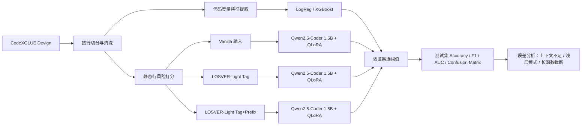

# 一周内完成深度学习课程大作业的可执行研究方案

## Executive Summary

你的课程作业明确要求：以“深度学习赋能软件工程”为主题，**参考近两年也就是 2025、2026 年的 TSE、TOSEM、ICSE、FSE、ASE、ISSTA 论文**，围绕一个具体软件工程任务设计并开展实验，最后提交一份 **4000–6000 字 PDF 报告**，截止时间是 **2026 年 6 月 15 日 23:59**。fileciteturn0file0

在“**必须以 2025/2026 年论文为主方法**”和“**必须在一周内稳妥做完**”这两个约束同时成立的情况下，我最推荐你把题目定为：**基于 ASE 2025 论文 LOSVER 的函数级漏洞检测轻量复现实验**。这篇论文来自允许的 venue，任务明确，官方摘要直接说明它在 **Devign、Big-Vul、PrimeVul** 上验证了方法有效性，并且在 Devign 上相对 UniXcoder 基线大约提升了 **4 个百分点准确率**；同时，它的核心思想“**给模型显式的行级关注信号**”非常适合在一周内做**轻量复现/受启发实现**。citeturn17search0

最稳妥的落地方案不是死磕论文里的完整两阶段实现，而是做一个**诚实、可复现、工程风险低的 LOSVER-Light**：以 **Qwen2.5-Coder-1.5B** 作为较新的代码骨干模型，用 **4-bit QLoRA/LoRA** 做高效微调，在 Devign 上比较“**无行级信号**”和“**有行级风险提示**”两种输入形式，再加一个**代码度量基线**。这样既满足了“主方法来自近两年论文”，又避免把整个项目变成复杂的多阶段安全研究复现。Qwen2.5-Coder 是 2024 年发布的代码专用系列，1.5B 版本有 **1.54B 参数**、**32,768 上下文长度**，官方模型卡还明确建议使用较新的 `transformers` 版本。citeturn8search0turn8academia52

如果一切顺利，你这一周应该能完成四类结果：**代码度量基线**、**现代代码 LLM baseline**、**LOSVER-Light 主方法**、**一组轻量消融**。即使主方法没有显著提升，这也不是失败，相反，它正好能和近两年的反思性工作形成呼应：ISSTA 2025 的论文指出，当前大量 ML 漏洞检测研究把问题定义成**函数级二分类**，但很多漏洞本质上离不开上下文；ICSE 2026 的论文进一步指出，某些 LLM 检测结果与传统代码度量存在强相关，说明模型可能仍然依赖浅层模式。你的实验因此既能“做出来”，也能“写得像研究”。citeturn19search6turn19academia27turn18search1turn18academia44

## 主参考论文与选题理由

我建议你把**主参考论文**定为：

| 项目 | 建议 |
|---|---|
| 主论文 | **LOSVER: Line-Level Modifiability Signal-Guided Vulnerability Detection and Classification** |
| 作者 | **Doha Nam, Jongmoon Baik** |
| Venue | **ASE 2025 Research Papers** |
| 论文链接 | 直接使用官方 ASE 页面作为主链接；如果老师要求补 DOI 或开放版本，可再附加 DBLP/DOI 入口。citeturn17search0turn17search1 |
| 为什么选它 | 题目属于要求范围内的**漏洞检测**；venue 完全符合课程要求；方法核心清晰；官方摘要直接说明在 **Devign/Big-Vul/PrimeVul** 上验证；非常适合做**“轻量复现 + 工程实现”**。citeturn17search0 |

这篇论文的方法可以用很少的话概括：它认为，现有 PLM 漏洞检测方法通常**没有显式告诉模型“代码的哪些部分更可能有问题”**，因此模型需要自己在整段代码里推断重要性。LOSVER 提出一个**两阶段框架**：先定位“**可修改行**”或“**不稳定/复杂、未来更可能被改动的代码行**”，再在漏洞检测阶段对这些行赋予更高权重，从而让 PLM 在训练和推理时把注意力更多放到潜在脆弱区域。官方摘要还说明，它在 Devign 上把 UniXcoder 基线的准确率提高了约 **4 个百分点**。citeturn17search0

为什么它比其他 2025/2026 论文更适合你这一周完成，关键在于**“研究思想强、实现可以轻量化”**。相较之下，ISSTA 2025 的 **VulnSC** 需要检索被调用函数源码并用 LLM 生成摘要，工程上更依赖原始项目上下文；FSE 2025 的 **MoEVD** 需要做 CWE 类型分解和专家路由，模型结构更复杂；TSE 2025 的 **LLMVulExp** 把检测和解释都纳入 instruction tuning，数据构造与训练链条更长。LOSVER 则把问题收敛到了一个很适合课程项目的问题：**行级信号能否帮助函数级漏洞检测**。citeturn5search1turn18search0turn1search1turn1academia44

这也是我推荐你做**“LOSVER-Light”而不是论文级全复现**的原因。课程作业不是复现赛，也没有要求你提交论文同等规模的工程系统；更合理的做法是：**忠实保留论文的核心研究思想，明确说明轻量化近似在哪里，并把实验做扎实**。你完全可以在报告中坦诚写明：原论文第一阶段使用“line-level modifiability signal localization”，而你的一周实现采用了**静态信号 + 规则评分**来近似这个阶段，用来生成可复现的“风险行提示”。这符合“根据近两年论文设计实验”的要求，也更适合按时交付。citeturn17search0turn19search6

为了让相关工作部分不空，我建议你同步引用下面这些**辅助/替代论文**。下面表中的论文信息均来自官方会议/期刊页面或作者开放版本。citeturn5search1turn0search0turn19search6turn18search1turn1search1

| 角色 | 论文 | 你在报告中怎么用 |
|---|---|---|
| 辅助论文 | **Enhancing Vulnerability Detection via Inter-procedural Semantic Completion**，ISSTA 2025 | 支撑“函数级检测缺少跨函数语义”的局限分析。citeturn5search1turn5search2 |
| 辅助论文 | **Large Language Models for In-File Vulnerability Localization can be Lost in the End**，FSE 2025 | 支撑“输入长度和上下文组织会影响检测效果”，可为 `max_length` 或输入组织消融提供理论动机。citeturn0search0turn0academia39 |
| 辅助论文 | **Top Score on the Wrong Exam: On Benchmarking in Machine Learning for Vulnerability Detection**，ISSTA 2025 | 支撑“函数级二分类 benchmark 本身存在外部效度问题”，可用于写局限性。citeturn19search6turn19academia27 |
| 辅助论文 | **LLM-based Vulnerability Discovery through the Lens of Code Metrics**，ICSE 2026 | 直接支撑你加入“代码度量基线”，并解释如果简单指标接近 LLM 结果意味着什么。citeturn18search1turn18academia44 |
| 可选辅助论文 | **Towards Explainable Vulnerability Detection With Large Language Models**，TSE 2025 | 可用于未来工作或讨论：检测不仅要分类，还需要给出开发者可用的解释。citeturn1search1turn1academia44 |

## 数据集、模型与实验设计

主数据集我建议选 **CodeXGLUE Defect Detection**，也就是基于 **Devign** 的函数级漏洞检测数据。官方数据卡说明它把任务定义成**二分类**：输入一段 C 语言函数代码，判断其是否为**不安全代码**；公开划分为 **21,854 条训练、2,732 条验证、2,732 条测试**，并采用 **80/10/10** 划分。这个数据集的优点不是“最新”，而是**公开、稳定、现成、非常适合一周内完成**。citeturn14view0turn13search0turn13search1

如果你在第 5 天还有余量，可以加一个**外部 sanity check**：从 **PrimeVul** 抽取一个小型平衡子集做补充测试。PrimeVul 的数据卡说明，它包含大约 **7,000 个 vulnerable functions** 和 **229,000 个 benign functions**，覆盖 **140+ CWE**，并强调更现实的数据清洗、时间划分和元数据；其对应论文也指出，很多旧数据集会高估代码模型在真实漏洞检测中的能力。我的建议不是把 PrimeVul 变成主战场，而是只做一个**小规模外部验证**，比如从验证集/测试集各抽一个平衡 sample，看看模型在“更新的数据分布”上是否明显退化。citeturn15search0turn15academia39

在模型选择上，我不建议你把 **CodeBERT/GraphCodeBERT** 作为主实验骨干。它们当然仍然有研究价值，但发布时间较早，而且你的课程要求明显更偏向“参考近两年论文设计实验”。更合适的做法是：**主方法来自 2025 论文 LOSVER，骨干模型用较新的开源模型**。我推荐首选 **Qwen2.5-Coder-1.5B**，理由是它是**代码专用**模型，参数规模对 2×3090 很友好，32k 上下文让你在做输入组织实验时有足够余地；如果你更希望骨干模型年份也更新到 2025，那么可选 **Qwen3-1.7B** 作为备选，但它不是专门的 code-only 系列，工程风险略高。citeturn8search0turn8search2turn21search0turn20academia24

我的核心建议是把实验问题收敛成下面三组研究问题。这个设计既和近两年论文对上，又不会把一周时间打散。

| 研究问题 | 你要回答什么 | 对应文献动机 |
|---|---|---|
| RQ-A | **LOSVER-Light 的行级引导是否优于同一骨干模型的 vanilla 输入？** | 对应 LOSVER 的主张：显式行级信号可以帮助模型聚焦潜在漏洞位置。citeturn17search0 |
| RQ-B | **信号形式是否重要？** 例如只有 `<MOD>` 标签，还是“标签 + 风险行前缀摘要”更好 | 对应 FSE 2025 对输入组织和长度敏感性的发现。citeturn0search0turn0academia39 |
| RQ-C | **简单代码度量基线能接近多大程度？** | 对应 ICSE 2026 关于“代码度量与 LLM 检测高度相关”的发现，以及 ISSTA 2025 对 benchmark shortcut 的质疑。citeturn18search1turn18academia44turn19search6turn19academia27 |

建议你采用下面这组实验。它既完整，又不会超过一周工作量。

| 实验组 | 模型 | 输入形式 | 目的 |
|---|---|---|---|
| Metrics-Baseline | Logistic Regression 或 XGBoost | 手工代码度量特征 | 检查浅层模式到底多强；哪怕它结果不高，也能作为研究对照。 |
| Vanilla-LLM | Qwen2.5-Coder-1.5B + QLoRA | 原始函数代码 | 现代开源代码 LLM 基线。 |
| LOSVER-Light Tag | 同上 | 对 top-k 风险行添加 `<MOD>` 标记 | 轻量模拟“行级 modifiability 引导”。 |
| LOSVER-Light Tag+Prefix | 同上 | 除了标记，还把 top-k 风险行拼到输入前缀 | 检查“显式聚焦摘要”是否进一步帮助分类。 |
| Optional External Check | 最好模型 | PrimeVul 小型平衡子集 | 检查主结果是否只在 Devign 上成立。 |

这里的**LOSVER-Light**我建议实现成**完全透明、完全可复现**的静态信号方案。具体做法是：先把每个函数按行切开，然后对每一行计算一个**风险分数**。评分特征可以非常实用：是否出现内存/字符串 API（`malloc/free/realloc/memcpy/strcpy/strncpy/sprintf/gets` 等）、是否有指针解引用和数组访问、是否有深层条件/循环、是否包含返回值检查或错误处理、是否过长或符号密集。最后取 top-k 行作为“modifiable/risky lines”。这不是论文原版第一阶段，但它直接保留了论文最重要的思想：**先找到更值得关注的行，再把这个信号喂给下游漏洞检测器**。citeturn17search0

超参数方面，我建议你从**能稳定跑通**而不是“尽量大”开始。对 2×3090 来说，Qwen2.5-Coder-1.5B 做 4-bit QLoRA 微调是很实际的。Hugging Face 文档说明，`bitsandbytes` 支持 4-bit 量化，并且这种模式常用于 **QLoRA**；PEFT 文档说明，LoRA 通过低秩适配显著减少了需要训练的参数量。citeturn9search1turn8search1

| 项目 | 推荐值 |
|---|---|
| backbone | `Qwen/Qwen2.5-Coder-1.5B` |
| task head | `AutoModelForSequenceClassification`，`num_labels=2` |
| fine-tuning | 4-bit QLoRA + LoRA |
| LoRA rank | 16 |
| LoRA alpha | 32 |
| LoRA dropout | 0.05 |
| target modules | `q_proj, k_proj, v_proj, o_proj, gate_proj, up_proj, down_proj` |
| max_length | 512 起步；如果截断比例偏高，再补一个 768 消融 |
| per-device batch size | 4 |
| gradient accumulation | 4 |
| 有效 batch | 32 |
| learning rate | 2e-4 |
| weight decay | 0.01 |
| warmup ratio | 0.05 |
| epoch | 3 |
| seeds | 42 为主；3407 用于最好配置复跑 |
| early stopping | 监控验证集 F1，patience=2 |

评估指标不要只放 Accuracy。由于漏洞检测天然容易受到类别分布和阈值选择影响，建议你至少报告 **Accuracy、Precision、Recall、F1、ROC-AUC、PR-AUC、Confusion Matrix**，并且用**验证集上最大化 F1 的阈值**去评估测试集。这样比固定 0.5 阈值更稳，也更像 software engineering 论文的写法。Devign 的官方任务定义就是二分类，因此这套指标完全合适。citeturn14view0turn13search1



上面的流程图把 LOSVER 的“先给行级关注信号，再做漏洞分类”思想，转写成了一个一周内真的能做完的工程实现；同时，它也把 ICSE 2026 关于代码度量的提醒直接纳入了实验设计。citeturn17search0turn18search1turn18academia44

## 环境、实现细节与可复现实验流程

环境建议尽量“**稳**”而不是“追新”。PyTorch 官方安装页面给出了 CUDA 12.1 的稳定安装入口；Qwen2.5-Coder 模型卡明确提醒 `transformers` 版本过低会报 `KeyError: 'qwen2'`，并建议使用较新的 Transformers；Accelerate 文档说明你可以直接用 `accelerate launch --multi_gpu --num_processes=2` 启动双卡训练；Transformers 文档提供了标准的 sequence classification 训练范式；Hugging Face 的量化文档则明确说明 4-bit 量化是 QLoRA 常用路径。citeturn10search0turn10search1turn8search0turn11search0turn11search5turn23search1turn9search1

我建议你固定下面这套版本。它不是“唯一正确答案”，但对 2×3090、Qwen2.5-Coder、QLoRA、Transformers/PEFT 组合来说足够稳。

| 组件 | 推荐版本 |
|---|---|
| OS | Ubuntu 22.04 LTS |
| Python | 3.10 |
| CUDA runtime | 12.1 |
| PyTorch | 2.4.0 |
| torchvision | 0.19.0 |
| torchaudio | 2.4.0 |
| transformers | 4.48.0 |
| datasets | 2.21.0 |
| peft | 0.14.0 |
| accelerate | 1.0.1 |
| bitsandbytes | 0.43.3 |
| scikit-learn | 1.5.1 |
| pandas | 2.2.2 |
| matplotlib | 3.9.2 |

显存和时间方面，**Qwen2.5-Coder-1.5B + 4-bit QLoRA** 对你这台机器是合适的。根据模型参数规模、4-bit 量化和 LoRA 训练方式，我更建议把双卡当成**数据并行加速器**，而不是为了“装得下模型”。保守估计，在 `max_length=512`、`per_device_batch_size=4`、`gradient_accumulation=4`、fp16 的设置下，**单卡显存峰值大概率在 14–20GB 左右**；3 个 epoch 的单次训练通常会落在**约 2.5–5 小时**区间内，具体取决于平均代码长度、I/O、日志频率和评估频率。这一时间是基于公开的模型规模与 QLoRA 训练方式做的工程估算，不是官方 benchmark，报告里建议你明确写成“保守估算”。citeturn8search0turn9search1turn8search1

为了可复现性，你的代码仓库最好从第一天开始就按下面的结构组织。这样后面写报告、打包作业、回滚实验都方便。

```text
project/
  README.md
  requirements.txt
  accelerate_config.yaml
  configs/
    vanilla_qwen.yaml
    losver_light_tag.yaml
    losver_light_tag_prefix.yaml
    metrics_baseline.yaml
  data/
    raw/
    processed/
  src/
    export_hf_dataset.py
    build_line_signals.py
    extract_code_metrics.py
    train_metrics_baseline.py
    train_qwen_cls.py
    evaluate.py
    error_analysis.py
    plot_results.py
    utils_seed.py
  outputs/
    run_vanilla_seed42/
    run_losver_tag_seed42/
    run_losver_prefix_seed42/
  reports/
    figures/
    tables/
```

你至少要保证下面这些复现规则：**固定随机种子**，保存每次运行的**配置文件**，导出**验证集最优阈值**，把**test prediction CSV、confusion matrix、训练日志、best adapter**都留档。这样一来，即使老师不看代码，也能看出你确实做了规范实验。ISSTA 2025 与 ICSE 2026 的相关论文都在强调当前漏洞检测研究中存在 benchmark shortcut、上下文不足和模式依赖问题，所以你把实验流程记录清楚，本身就是一种对这些问题的回应。citeturn19search6turn18search1

下面这张表可以直接作为你的**实验执行手册**。里面的命令是按“从零到出图”的顺序排好的，照着跑就行。

| 阶段 | 目的 | 命令示例 |
|---|---|---|
| 建环境 | 创建运行环境 | `conda create -n dlse python=3.10 -y && conda activate dlse` |
| 装 PyTorch | 安装 CUDA 12.1 版本 | `pip install torch==2.4.0 torchvision==0.19.0 torchaudio==2.4.0 --index-url https://download.pytorch.org/whl/cu121` |
| 装其余依赖 | 安装 HF/PEFT/评估库 | `pip install transformers==4.48.0 datasets==2.21.0 peft==0.14.0 accelerate==1.0.1 bitsandbytes==0.43.3 evaluate==0.4.3 scikit-learn==1.5.1 pandas==2.2.2 matplotlib==3.9.2` |
| 下载数据 | 拉取 CodeXGLUE Devign | `python src/export_hf_dataset.py --dataset code_x_glue_cc_defect_detection --out data/raw/devign_hf` |
| 预处理 | 生成行级风险信号 | `python src/build_line_signals.py --in data/raw/devign_hf --out data/processed/devign_losver --top_k 5` |
| 度量基线 | 提取代码度量并训练 LR/XGB | `python src/train_metrics_baseline.py --train data/processed/devign_losver/train.jsonl --valid data/processed/devign_losver/valid.jsonl --test data/processed/devign_losver/test.jsonl --seed 42` |
| LLM baseline | 训练 vanilla Qwen 分类器 | `accelerate launch --multi_gpu --mixed_precision fp16 --num_processes 2 src/train_qwen_cls.py --config configs/vanilla_qwen.yaml --seed 42` |
| 主方法 | 训练 LOSVER-Light Tag | `accelerate launch --multi_gpu --mixed_precision fp16 --num_processes 2 src/train_qwen_cls.py --config configs/losver_light_tag.yaml --seed 42` |
| 主方法增强 | 训练 Tag+Prefix | `accelerate launch --multi_gpu --mixed_precision fp16 --num_processes 2 src/train_qwen_cls.py --config configs/losver_light_tag_prefix.yaml --seed 42` |
| 第二种子复跑 | 检查稳定性 | `accelerate launch --multi_gpu --mixed_precision fp16 --num_processes 2 src/train_qwen_cls.py --config configs/losver_light_tag_prefix.yaml --seed 3407` |
| 统一评估 | 生成指标与混淆矩阵 | `python src/evaluate.py --runs outputs/run_* --metric best_f1` |
| 误差分析 | 导出错例 | `python src/error_analysis.py --pred outputs/run_losver_prefix_seed42/test_predictions.csv --out reports/tables/error_cases.xlsx` |
| 出图 | 画柱状图/ROC/PR/混淆矩阵 | `python src/plot_results.py --runs outputs/run_* --out reports/figures` |

如果你想用 `AutoModelForSequenceClassification`，Transformers 的文本分类指南和 `AutoModelForSequenceClassification` 文档已经给出了标准范式；如果你发现 Qwen tokenizer 没有显式 `pad_token_id`，PEFT 的 sequence classification 教程也给出了“把 `pad_token_id` 设成 `eos_token_id`”这类通用处理方式。citeturn23search0turn23search1turn24search1

## 七天时间表

因为今天是 **2026 年 6 月 6 日**，而截止时间是 **6 月 15 日晚**，最合理的策略不是把七天排满到死，而是按照 **6 月 6 日到 6 月 12 日完成主体工作，6 月 13–14 日预留修补和排版缓冲**。这样就算中间有一两次训练翻车，也不至于失控。作业截止时间来自你上传的要求文档。fileciteturn0file0

下面是我建议你执行的**按半天细分**时间表。它专门按照“一个人、一周、双 3090、要写报告”的现实来设计。

| 天数 | 时间段 | 任务 | 预期产出 |
|---|---|---|---|
| 第一天 | 上午 | 精读课程要求；通读 LOSVER 官方摘要、辅助论文摘要；确定题目、RQ、数据集、主方法 | 题目最终版；1 页实验计划草案 |
|  | 下午 | 建环境；下载 Devign；写 `export_hf_dataset.py` 和数据检查脚本 | `data/raw/`；数据统计表；能成功打印样本 |
| 第二天 | 上午 | 实现 `build_line_signals.py`；确认 top-k 风险行标注格式；画出流程图 | `train/valid/test.jsonl` 预处理结果 |
|  | 下午 | 实现代码度量提取；跑完 Metrics-Baseline | 第一组 baseline 指标表 |
| 第三天 | 上午 | 跑通 Qwen2.5-Coder vanilla 微调的 smoke test，只用少量样本验证代码链路 | loss 正常下降；没有 OOM |
|  | 下午 | 跑 full baseline：Vanilla-LLM，seed=42 | baseline 完整验证/测试结果 |
| 第四天 | 上午 | 跑 LOSVER-Light Tag，seed=42 | 主方法第一版结果 |
|  | 下午 | 跑 LOSVER-Light Tag+Prefix，seed=42 | 主方法增强版结果；初步对比表 |
| 第五天 | 上午 | 选最优配置，用 seed=3407 复跑；若时间允许加 `max_length=768` 或 `top_k=3/8` 消融 | 稳定性结果；一张消融表 |
|  | 下午 | 做误差分析：长函数、危险 API、跨函数依赖、误报/漏报案例 | 10–20 个错例；错误类别表 |
| 第六天 | 上午 | 写报告：引言、相关工作、方法、实验设置 | 2500–3500 字初稿 |
|  | 下午 | 写结果分析、局限性、未来工作；整理图表 | 4000–5500 字完整初稿 |
| 第七天 | 上午 | 校对所有数字、图题、表题、引文；完善 README 和运行说明 | 最终图表、最终配置清单 |
|  | 下午 | 导出 PDF；打包代码、日志、LoRA adapter、结果 CSV | 可提交版本 |

如果你每天能投入 **6–8 小时**，这个排期是现实的。真正占时间的不是“训练”，而是**环境、预处理、第一次跑通、结果整理和写作**。训练本身你完全可以夜里挂着跑，但上面的安排不依赖“后台承诺”，因为每一天都留出了足够的同步处理空间。citeturn11search0turn10search0turn9search1

## 风险、调试与降级方案

最大的技术风险不是模型本身，而是**工程碎片化**。Qwen2.5-Coder 模型卡已经明确说了，如果 `transformers < 4.37.0`，你可能会遇到 `KeyError: 'qwen2'`；Hugging Face 的量化文档也说明了，4-bit/8-bit 量化依赖 `bitsandbytes` 和 `accelerate` 的正确组合；Accelerate 官方文档则给出了双卡启动的标准命令。也就是说，只要环境版本乱了，后面所有实验都会拖慢。citeturn8search0turn9search1turn11search0

下面这些问题是你最可能遇到的，我把对应处理一起给你列出来。

| 常见问题 | 典型症状 | 处理建议 |
|---|---|---|
| Transformers 版本过低 | `KeyError: 'qwen2'` 或模型类识别失败 | 升到 `transformers>=4.37`，建议直接用我上面给的固定版本。citeturn8search0 |
| bitsandbytes 没有 GPU 支持 | 量化加载失败或 fallback 到 CPU | 重新安装匹配 CUDA 的 `bitsandbytes`，并用 `python -c "import bitsandbytes as bnb"` 自检。citeturn9search1 |
| OOM | 训练刚开始就爆显存 | 先把 `max_length` 从 512 降到 384；再把 `per_device_batch_size` 从 4 降到 2；保留 grad accumulation。 |
| DDP 不稳定 | 双卡 hang 住或者只跑一张卡 | 先确保 `accelerate config` 正常，再用 `accelerate launch --multi_gpu --num_processes 2`；如果还不稳，暂时改单卡跑主实验，不影响交作业。citeturn11search0turn11search5 |
| 训练效果异常好或异常差 | 验证集 F1 极端异常 | 检查是否把标签信息“泄露”进特殊 token；检查 train/valid/test 是否串了；检查 bool/int 标签映射。 |
| 结果没有提升 | 主方法不如 baseline | 不要慌。这本身就是可写结果，尤其能与 ISSTA 2025 和 ICSE 2026 的“shallow pattern / benchmark shortcut”讨论对上。citeturn19search6turn18search1 |

更重要的是，你要提前准备**降级/简化方案**。一周项目最怕“只有一个完整大计划，没有退路”。下面这 4 个方案里，前 3 个至少要提前接受其中一个是“正式备用路线”。

| 降级方案 | 触发条件 | 怎么做 | 报告还能否完整提交 |
|---|---|---|---|
| 轻量降级 | 双卡训练不稳 | 改为**单卡** QLoRA，`batch=2`、`grad_acc=8`、`max_length=384`，只跑 Vanilla 与 LOSVER-Light Tag 两组 | 可以，几乎不影响主线 |
| 模型降级 | 1.5B 仍然 OOM 或速度太慢 | 换成 **Qwen3-1.7B** 或更小的公开模型；保持实验结构不变，只在报告中说明骨干替换原因 | 可以，仍满足“主方法来自 2025 论文” citeturn21search0turn20academia24 |
| 实验降级 | 时间只剩 2–3 天 | 保留 **Metrics-Baseline / Vanilla-LLM / LOSVER-Light Tag** 三组，取消 PrimeVul 与第二 seed | 可以，仍然有 baseline、主方法、误差分析 |
| 写作降级 | 结果已出但报告来不及 | 先完成“引言—相关工作—方法—实验设置—核心结果—局限性”六段式报告，图表只保留 3 张核心图 | 可以，质量仍然足够交作业 |

还有一个很重要的认知：**如果你的 Metrics-Baseline 接近或部分超过 LLM baseline，这不是坏事，而是好结果。** ISSTA 2025 直接质疑了函数级二分类 benchmark 的有效性，ICSE 2026 又指出代码度量和 LLM 预测可能存在强耦合。所以一旦你观察到“简单特征也很强”，你就有了非常有分量的分析点：这说明当前任务设置可能仍然允许模型利用表面模式，而不是充分理解真实漏洞因果结构。citeturn19search6turn19academia27turn18search1turn18academia44

## 报告大纲、推荐引文与最终交付物

你的最终报告要控制在 **4000–6000 字**，而且题目是课程报告，不是论文复现说明书。因此结构要像“**小型实证研究**”，而不是“流水账”。课程要求明确写了：需要写**任务、研究现状、深度学习技术原理、方法细节、实验设计、结果分析、结论**等内容。fileciteturn0file0

我建议你直接按下面的结构写，基本不需要再改框架。

| 报告部分 | 建议写法 | 关键要点 |
|---|---|---|
| 引言 | 1–2 段 | 漏洞检测的重要性；函数级检测为什么流行；为何需要近两年研究视角。 |
| 相关工作 | 3 小段 | LOSVER 的行级信号；VulnSC 的跨函数语义；Lost-in-the-End 的输入组织问题；Top Score 和 ICSE 2026 对 benchmark/浅层模式的反思。 |
| 方法 | 2–3 小段 + 一张图 | 先解释原论文 LOSVER 核心思想，再解释你的 LOSVER-Light 如何近似实现。 |
| 实验设置 | 1–2 小段 + 一张表 | 数据集、划分、模型、超参数、硬件、软件版本、评价指标、随机种子。 |
| 结果与分析 | 最长部分 | 结果表、消融表、 confusion matrix、错例分析；如果 metrics baseline 也强，要重点解释。 |
| 局限性与未来工作 | 1–2 段 | 你没有完整复现论文第一阶段；函数级数据集上下文有限；未充分测试 PrimeVul/Big-Vul。 |
| 结论 | 1 段 | 总结主发现，不要写空话，直接回答 RQ。 |

你在报告和代码里**至少应该引用并讨论下面这 5 篇 2025/2026 论文**。这些论文都来自你课程允许的 venue，且它们正好对应你实验中最关键的几个论点。下面表中的信息来自官方会议/期刊页面或作者开放版本。citeturn17search0turn5search1turn0search0turn19search6turn18search1turn1search1

| 推荐引用 | 用途 |
|---|---|
| **LOSVER: Line-Level Modifiability Signal-Guided Vulnerability Detection and Classification**，ASE 2025 | 主方法来源。citeturn17search0 |
| **Enhancing Vulnerability Detection via Inter-procedural Semantic Completion**，ISSTA 2025 | 写“函数级上下文不足”的研究现状。citeturn5search1turn5search2 |
| **Large Language Models for In-File Vulnerability Localization can be Lost in the End**，FSE 2025 | 写“输入组织/上下文长度影响结果”。citeturn0search0turn0academia39 |
| **Top Score on the Wrong Exam: On Benchmarking in Machine Learning for Vulnerability Detection**，ISSTA 2025 | 写 benchmark 局限和 shortcut 风险。citeturn19search6turn19academia27 |
| **LLM-based Vulnerability Discovery through the Lens of Code Metrics**，ICSE 2026 | 支撑你加入 metrics baseline，并分析如果浅层特征接近主模型意味着什么。citeturn18search1turn18academia44 |
| **Towards Explainable Vulnerability Detection With Large Language Models**，TSE 2025 | 可作为未来工作：检测之外还需要解释。citeturn1search1turn1academia44 |

最后，交付物不要只剩一个 PDF。虽然课程系统只收 PDF，但你自己最好准备一个完整的“**可答辩包**”。

| 交付物 | 必要性 | 说明 |
|---|---|---|
| `学号+姓名.pdf` | 必须 | 课程要求唯一正式提交物。fileciteturn0file0 |
| 代码仓库 | 强烈建议 | 至少包含 `README`、`requirements.txt`、`configs`、`src`。 |
| 运行说明 | 强烈建议 | 一页即可，写清数据下载、训练、评估命令。 |
| LoRA adapter 权重 | 建议 | 不必保存完整基础模型，只保存 adapter，体积更小。 |
| 训练日志 | 建议 | `train.log`、`eval.json`、tensorboard 或 csv 都行。 |
| 核心图表 | 建议 | 结果柱状图、混淆矩阵、消融表、错例分析表。 |
| 测试集预测文件 | 建议 | `test_predictions.csv`，方便之后追问时快速核查。 |
| 配置快照 | 建议 | `accelerate_config.yaml`、每个 run 的 yaml、seed。 |

如果你严格执行上面的方案，那么你最终提交的不是“老模型复现”，而是一个**以 ASE 2025 论文 LOSVER 为主方法、以 Devign 为主数据集、以现代开源代码 LLM 为骨干、带有近两年相关工作支撑和完整对照实验的一周课程项目**。这正是当前时间、资源和课程要求三者之间最稳的交集。